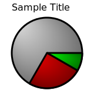

golang-examples
===============

My go language examples

Pie chart generator
includes:
* testPieChartSvg.go -- Main file for testing the pie chart generator
* src/chart/pie.go -- Actual brute force pie chart generator tha could be made way more configurable. Just wanting to learn some go.
* testPieChartSvgOut.svg -- Sample output from the generator
	

